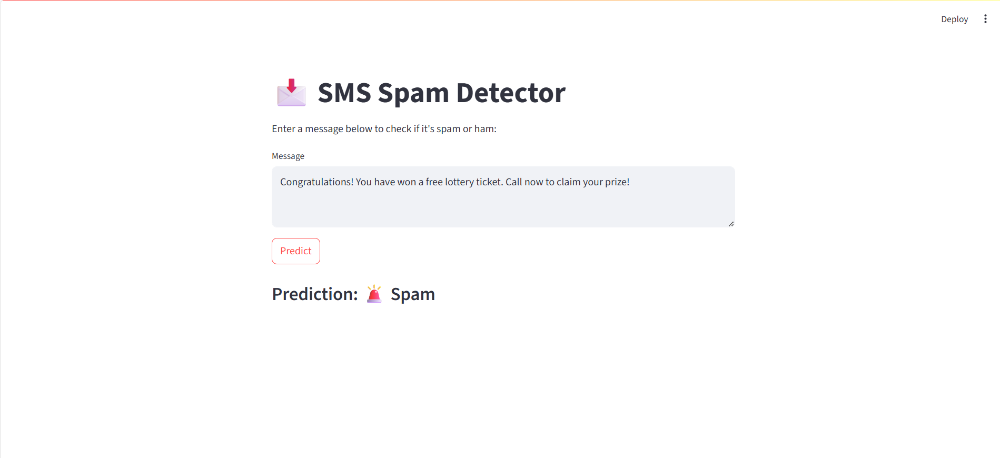

# SMS Spam Classifier

A simple machine learning project to classify SMS messages as **spam** or **ham** (not spam) using Python.

---

## Features
- Classifies SMS messages using **Naive Bayes**.
- Achieves around **97% accuracy** on the test set.
- **Streamlit app** for real-time predictions.

---

## Tech Stack
- Python
- scikit-learn
- Streamlit

---

## How to Use
1. Clone the repo:
```bash
   git clone https://github.com/Prasannamudadla/SMS-Spam-Classifier.git
   cd sms-spam-classifier
```

2. Install dependencies:
```bash
pip install -r requirements.txt
```

3. Run the app:
```bash
streamlit run app.py
```

The dataset used is the [UCI SMS Spam Collection](https://archive.ics.uci.edu/dataset/228/sms+spam+collection) .

**Note**
The data/ folder is not included in this repo. Download the dataset from the link above to run the model.


---

### requirements.txt
Dependencies are listed in [requirements.txt](requirements.txt).

## Demo


**Example Input:**  
`Congratulations! You have won a free lottery ticket. Call now to claim your prize!`

**Prediction:**  
`🚨Spam`

**Example Input:**  
`Hey, are we still meeting at 6 pm for dinner?`  
**Prediction:**  
`✅Ham`

